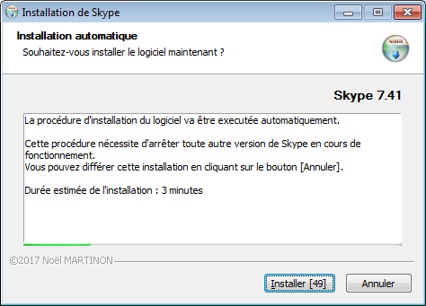

# Setup_auto
Utilitaire d'installation configurable avec délai d'exécution automatique

Permet de proposer l'installation d'une application que l'utilisateur peut soit accepter soit refuser.
Sans réponse, l'exécution est automatique après un délai défini.



## Fonctionnalités
Le paramètrage se fait via fichier 'ini' :
- Délai avant et après installation
- Textes d'information concernant la procédure et sa progression
- Commandes à lancer en début de procédure avec choix de l'indiquer ou non à l'utilisateur
- Désinstaller un programme en cherchant sa commande de désinstallation dans les programmes installés dans le système
- Installer le logiciel sous des conditions permettant de vérifier son existence par nom et version afin d'éviter une installation inutile
- Commandes de post-installation

## Usage

### Fichier 'ini'
Voir l'exemple "setup_auto.ini".

### Utilitaire "setup_auto.exe"
(Exécutable généré avec l'outil NSIS et le script 'nsi' fourni)

OPTIONS :
- aucun argument : utilisation de "setup_auto.ini" situé dand le même répertoire que "setup_auto.exe"
- /config inifile : spécifie l'emplacement du fichier de configuration (par défaut setup_auto.ini où se trouve setup_auto.exe)
- /help ou /? : afficher cette aide

VALEUR DE RETOUR (ERRORLEVEL) :
- 0 - Execution normale (aucune erreur)
- 1 - Installation annuler par l'utilisateur (bouton [Annuler])
- 2 - Installation annuler par Setup_auto (problème d'ouverture du fichier de configuration, erreur de désinstallation, exécution impossible de la commande de préinstallation ou d'installation de l'application)
- AUTRE - errorlevel retourné par l'application à installer

Des copies d'écran son disponibles dans le répertoire 'screenshot'.

### Aller plus loin !
En tant qu'administrateur système ayant des clients windows dont les droits son "simple utilisateur", en utilisant conjointement [**ExecAs**](https://github.com/noelmartinon/ExecAs), un outil de déploiement peut très bien exécuter la commande suivante :
1. Générer une commande cryptée qui est exécutée par un compte administrateur :
    ```
    ExecAs.exe -c -n -r -uadmin -ppasswd -d -w setup_auto.exe
    ```
    ce qui donne par exemple dans le presse-papier :
    ```
    T05LU0dPaEU40pIY6ET56pru+D3yO1eJEBRxjU+8i0sy+GRUm3QNRfbi+IZrS7EDjs73m+OqJuvKECSuTBzlJofmjlN1dNSBdS9fYY/SUK4PLeoN0dQBFw==
    ```
2. Dans l'outil de déploiement utiliser par exemple :
    ```
    ExecAs.exe -i -h -w ExecAs.exe T05LU0dPaEU40pIY6ET56pru+D3yO1eJEBRxjU+8i0sy+GRUm3QNRfbi+IZrS7EDjs73m+OqJuvKECSuTBzlJofmjlN1dNSBdS9fYY/SUK4PLeoN0dQBFw==
    ```
    Ici le -h permet de masquer la fenêtre de console créée par le second ExecAs.exe

## License
GNU General Public License v3.0

Copyright (C) 2017  Noël Martinon